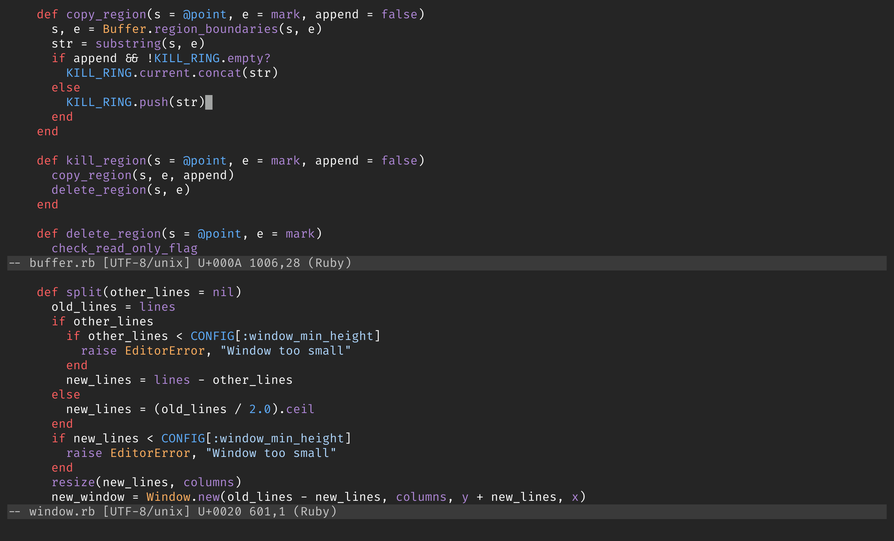

# 

[![ubuntu]https://github.com/shugo/textbringer/workflows/ubuntu/badge.svg](https://github.com/shugo/textbringer/actions?query=workflow%3Aubuntu)
[![windows]https://github.com/shugo/textbringer/workflows/windows/badge.svg](https://github.com/shugo/textbringer/actions?query=workflow%3Awindows)
[![macos]https://github.com/shugo/textbringer/workflows/macos/badge.svg](https://github.com/shugo/textbringer/actions?query=workflow%3Amacos)

Textbringer is a member of a demon race that takes on the form of an Emacs-like
text editor.

## Screenshot

## Demo

* FizzBuzz: https://asciinema.org/a/103357
* Ruby Programming: https://asciinema.org/a/100156
* Japanese Text Editing: https://asciinema.org/a/100166

## Installation

    $ gem install textbringer

You need ncursesw to use multibyte characters.
Install ncursesw before installing curses.gem, on which textbringer depends.

    $ sudo apt-get install libncursesw5-dev
    $ gem install curses

## Usage

    $ textbringer

You can quit the editor by `Ctrl-x Ctrl-c`.

Many commands and key bindings are similar to [Emacs](https://www.gnu.org/software/emacs/).

Type `F1 b` or `Alt+x describe_bindings RET` to see key bindings.

## Configuration

### Meta key

You need the following configuration of terminal emulators to use meta key.

#### xterm

Add the following line to ~/.Xresources.

    XTerm*metaSendsEscape: true

#### mlterm

Add the following lines to ~/.mlterm/main.

    mod_meta_key = alt
    mod_meta_mode = esc

### East asian ambiguous width

Add the following line to ~/.textbringer.rb to treat
[ambiguous characters](http://unicode.org/reports/tr11/#Ambiguous)
as fullwidth.

    CONFIG[:east_asian_ambiguous_width] = 2

You also need a LD_PRELOAD hack or a modified locale charmap because ncursesw
uses wcwidth(3).

* https://github.com/fumiyas/wcwidth-cjk
* https://github.com/hamano/locale-eaw

xterm, mlterm and screen have their own configuration options.

#### xterm

Add the following lines to ~/.Xresources.

    xterm*utf8: 1
    xterm*locale: true
    xterm*cjkWidth: true

#### mlterm

Add the following line to ~/.mlterm/main.

    col_size_of_width_a = 2

#### screen

Add the following line to ~/.screenrc.

    cjkwidth on

## Development

After checking out the repo, run `bundle install` to install dependencies. You can also run `bin/console` for an interactive prompt that will allow you to experiment.

To install this gem onto your local machine, run `bundle exec rake install`. To release a new version, update the version number in `version.rb`, and then run `bundle exec rake release`, which will create a git tag for the version, push git commits and tags, and push the `.gem` file to [rubygems.org](https://rubygems.org).

## Contributing

Bug reports and pull requests are welcome on GitHub at https://github.com/shugo/textbringer.

## License

The gem is available as open source under the terms of the [MIT License](http://opensource.org/licenses/MIT).
